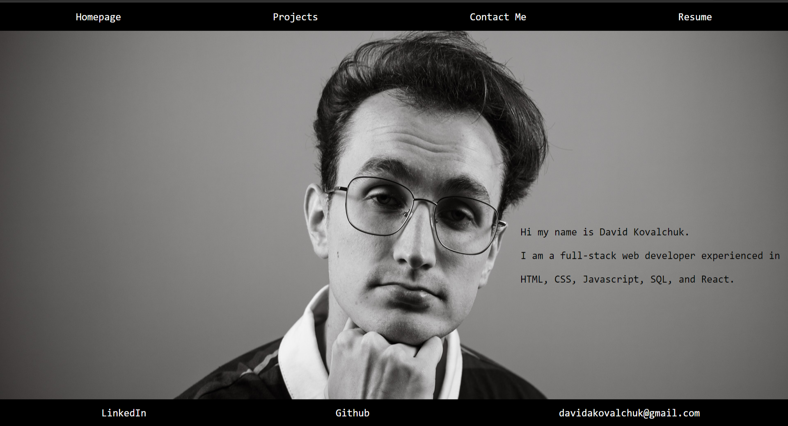

# react-portfolio
## Description
    
react-portfolio is a website made with react. It gives out my information for recruiters looking for me a web developer to potentially hire or reach out to me, and see my work.
## Table of Contents
- [Contributions](#contributions) 
- [Installation](#Installation) 
- [Website_Screenshot](#website_screenshot)
- [Link](#link)
- [Questions](#questions) 
## Contributions

David Kovalchuk
## Installation
No installation needed.

## Website_Screenshot

## Link
https://davidkovalchuk.netlify.app/#Home
## Questions
You can reach me on GitHub at [itsDavidK](https://github.com/itsDavidK).
